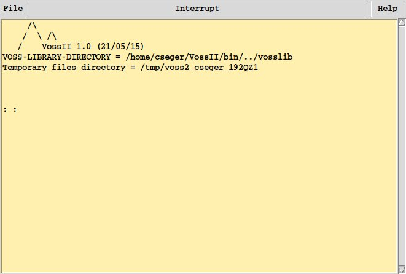
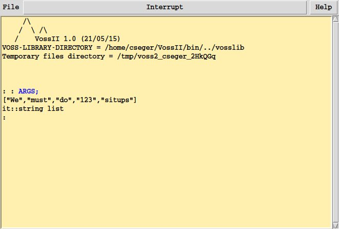
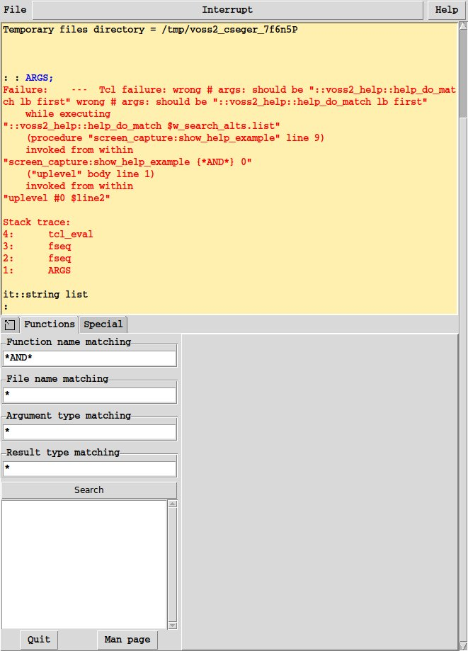

Getting Started with VossII and fl
==================================

This tutorial is an introduction to the VossII software suite, and the "fl"
programming language used to interface with it.
The tutorial assumes that you are familiar with at least one other programming
language, and after completing it you will be able to read and write simple
programs in fl, as well as know where to look for more in-depth information
on any particular fl-related topic.


What is fl?
-----------

VossII is a software suite for describing visualising, analysing and proving
properties about integrated circuits.

Similar to many theorem provers, the VossII command language
for the verification system is a general purpose programming language.
In fact, the fl language shows a strong degree of influence from the version of
ML used in the [HOL-88 system](https://en.wikipedia.org/wiki/HOL_(proof_assistant)).
However, there are several differences; many syntactic but some more fundamental.

In particular, the functional language used in VossII has
[lazy evaluation semantics](https://en.wikipedia.org/wiki/Lazy_evaluation).
In other words, no expression is evaluated until it is absolutely needed.
Similarly, no expression is evaluated more than once.
Another difference is that Boolean functions are first-class objects
and can be created, evaluated, compared and printed out.
For efficiency reasons these Boolean functions are represented as ordered binary
decision diagrams.


Running fl
----------

If the VosSII system installed on your system and available on your `$PATH`,
simply run the command `fl` in a terminal window to get a stand-alone
version of fl.



The `fl` program accepts a number of arguments.
More specifically:

* `-f FILE`: start fl by first reading in the content of the file named `FILE`.
* `-I DIR`: Set the default search directory to `DIR`.
* `-noX` or `--noX`: do not use the graphical (X-windows) interface.
    Useful when running batch oriented jobs.
    Note that any calls to graphics primitives will fail with a
    runtime exception when fl is run in the `-noX` mode.
* `-use_stdin` or `--use_stdin`: read input from `stdin` as well as
    from the graphical interface.
* `-use_stdout` or `--use_stdout`: write output from stdout as well as
    from the graphical interface.
* `--read_input_from_file FILE`: read input continously from the file `FILE`.
* `--write_output_to_file FILE`: write output to the file `FILE` in addition to
    the graphical user interface.
* `-r SEED`: initialize the random number generator with the seed `SEED`.
    This allows the `rvariable` command to create new sets of random variable
    values.
    See the `rvariable` command description in sect. 3 of the fl user's guide
    for more details.
* `-v FILE`: store the variable ordering obtained by dynamic variable re-ordering
    in the file `FILE`.
* `-h` or `--help`: print out the available options and quit.

Any additional arguments to `fl` will be stored in the fl expression `ARGS` as
a list of strings. For example, the command `fl We must do 123 situps`
would yield:




While it is perfectly possible to run the stand-alone fl interpreter in this
manner, VossII meant to be used as an interactive tool.
As interactive tools are often best used in tight integration with a text editor,
we provide VossII integration with Emacs and vim.
These integrations provide syntax highlighting and fl command execution directly
from the respective text editor.

You can find these integrations, along with documentation on how to install
and use them, in the `modes` directory of the fl binary and source distributions.


Using the Help System
---------------------
Fl has an interactive help system, which you can access by pressing the
*Help* button in the upper right corner of the stand-alone interpreter
or by calling the `open_help ()` function from within fl.

Whenever a function is defined, it is added to the online help system.
Furthermore, if the function declaration is preceeded by some comments
(lines started with //), the comments will be displayed together
with information of the fixity (if any), number and types of input arguments,
as well as the type of the result of the function.
Also, if the function is defined by fl code, there will be a live link to the
code used to define the function.
The help system allow the user to serach by name, file, argument type(s) or
resulting type using regular globbing style patterns.



Now that we've covered the essentials of running the software, let's jump
straight into...


Your First fl Program
---------------------

Like all self-respecting programming language tutorials, this one starts by
writing the *Hello World* program. Open up the fl interpreter (or the fl mode
in your editor, if that's your style) and enter the following program,
which applies the function `print` to the string `"Hello, World!\n"`:

```fl
print "Hello, world!\n";
```

Unsurprisingly, this results in the interpreter echoing back _"Hello, world!"_
However, `print` is commonly a statement, but fl, being a functional language,
does not have statements - only expressions.

Since we know that all expressions have types, this begs the question:
what is the type of `print`?
We can find out by simply typing the function `print` without giving it an
argument.

```fl
print;
```

As we can see, `print` has the type `string -> void`; a function which takes
a single argument of type `string` and returns a value of type `void`.
While `string` is relatively self-explanatory, what is the meaning of `void`?

`void` is a singleton (i.e. inhabited by a single value) type, which is
commonly returned from functions which only exist to perform _effects_.
`print` is such a function, as it _prints_ its argument to the user interface,
and does nothing else.

As you have probably deduced from these examples, fl uses the semicolon (`;`)
to denote the end of a top-level expression.
This means that you can write long expressions, and even string literals,
across multiple lines as long as you terminate the expression with a semicolon:

```fl
print
"I have discovered a truly marvelous proof of this,
which a single line is too narrow to contain.\n"
;
```


Expressions and Types
---------------------

All fl programs consist of zero or more expressions, where each expression has
a type. We've already seen the `string` and `void` types, and fl comes with a
rich library of types right out of the box:

* `int`: arbitrary precision integers;
* `float`/`double`: single and double precision floating point numbers;
* `string`: 8 bit ASCII strings;
* `bool`: Boolean functions encoded using binary decision diagrams;
* `* list`: lists where all elements have the same type `*`;
* `* # ** # ...`: tuples whose elements may have different types;
* `* -> ** -> ... -> ***`: functions from type `*`, `**`, etc. to `***`;
* ...and many more.

Arithmetic expressions behave as you would expect them to in any
programming language:

```fl
1 * 2 + 3;
(3+3) % 5;
5.5 / 10.0;
```

Lists are defined either as a comma-separated list of items enclosed in brackets,
or by using the `:` ("cons") operator on an element and another list.
Tuples are defined as a comma-separated list of items, which may optionally
be enclosed in parentheses.

```fl
[1, 2, 3];
"these" : "are" : "strings" : [];

("a string", ["a", "list"], 42);
```

Constants and functions may be declared using the `let` keyword.
For instance, we can define a constant `zero` and the successor function
`succ` as follows:

```fl
let zero = 0;
let succ x = x + 1;
```

Functions may use _pattern matching_ to case split on their arguments:
when the function's argument matches what's found to the _left_ of the `=`,
return the expression to the _right_.
For example, we can define the following rather sloppy function to convert an
integer to a natural language representation in English.

Note the use of an underscore as the pattern of the `"many"` case at the end.
An underscore or a variable name matches _any_ value when used in a pattern.
The only difference between the two is that using a variable in a pattern will
bind the corresponding value to that variable on the right-hand side of the `=`,
whereas an underscore will just match the value and *not* bind it.

```fl
let to_string 0 = "zero"
   /\ to_string 1 = "one"
   /\ to_string _ = "many"
   ;

to_string 0;
```

Note the use of the `/\` "legs" construct to introduce additional cases of the
`to_string` function, and the semicolon terminating the final case.

It is important to remember that `let`-bindings are not recursive by default.
Thus, the following attempt to write the factorial function fails miserably:

```fl
let fac 0 = 1
   /\ fac n = n*fac (n-1)
   ;
```

Instead, we must use the `letrec` keyword to define recursive functions:

```fl
letrec fac 0 = 1
      /\ fac n = n*fac (n-1)
      ;

fac 5;
```

While fl is statically typed, we have yet to see any type annotations.
This is because fl implicitly infers the type of any expression we write.
Numeric literals without decimals are assumed to be of type `int`, and
literals _with_ decimals are assumed to be of type `float`.
Fl always tries infer the most general type for an expression, which means
that we can, for instance, write a function to extract the first element of
a tuple which works for all tuples:

```fl
let first (x, y) = x;

first ("hello", 5.5, 123);
first (1, 2);
```

However, sometimes we want to use more specific types, help the type checker
infer our types by providing extra information, or just be explicit about the
types of a function. In this case, we can use the `::` type annotation operator
on an expression, and enclose the annotated expression in curly braces:

```fl
let firstForStrings (x, _) = {x :: string};

firstForStrings ("hello", 5.5, 123);
firstForStrings (1, 2);
```

Note how the type of the function changes from `(* # **) -> *` to
`(string # *) -> string`, and how we now get a type error if we try to apply
the function to a tuple with a non-`string` first element.

We can also use type annotations in patterns,
to the left of the `=`, or on a more complex expression rather than just
an identifier:

```fl
let firstForStrings ({x :: string}, _) = x;

let addTwoInts x y = {(x + y) :: int};
```

fl employs lexical scoping.
This means that a function which refers to some other identifier
will keep referring to the identifier which was in scope
*at the time of definition*, even if that identifier is later redefined.
Consider this example, where `two` is overwritten, but the return value of
the function `addTwo` which refers to it remains the same.

```fl
let two = 2;
let addTwo x = two + x;
let two = 3;
addTwo 2;
```

This is in contrast to dynamically scoped languages like Emacs Lisp, where
functions instead use the version of the identifier in scope at the time
of application.


Scripts
-------

Expressions may be either typed into the interpreter directly, or stored
in a _script_ for later execution.
Scripts typically have the `.fl` file extension, and can be loaded using the
`load` function.
To try it out, save the following program to a file named `hello.fl`:

````
print "Hello, World!\n";
print "This print brought to you by a .fl script!\n";
````

<div class="tip">
When invoked from the interpreter, the `load` function looks for script files
relative to the current working directory.
When invoked from a script file, it will look for script files
*relative to the directory of the calling script*.
</div>

Then, load it in the interpreter:

```fl
load "hello.fl";
```

Loading a script will execute the file line by line, as though it were manually
typed into the interpreter.
This means that you can load a script twice (or more), and the whole file will
be executed anew.
This is handy when you've updated your script and want to make those changes
visible to the interpreter. Note, however, that this is equivalent to
redeclaring everything in the script.
This can cause unpleasant side-effects if you've made changes to a type
in your script, which some function defined in another script or interactively
depends on.

Fl programs (scripts as well as those entered directly into the interpreter)
may have comments, preceded by two slashes:

````
print "Hello, World!\n";

// Look at me, I'm a comment!
print "This print brought to you by a .fl script!\n";
````

Comments begin with two slashes, and extend until the end of the line.
It is worth reiterating, that comments placed before a constant of function
definition will be picked up and displayed by the help system when viewing
that entry, to properly documenting your code is highly recommended!


More About Types
----------------

In addition to the built-in ones, fl allows you to define your own data types
using the `lettype` keyword. Each type consists of one or more
*data constructors* which each have zero or more *arguments*.
For instance, we can model a playing card using the following types:

<div class="warning">
A word of warning: while it is possible to redefine a previously declared type,
any function referring to that type must also be defined anew, with the new
type definition in scope.

The behavior of a function referring to a type which has been redefined is
undefined!
</div>

```fl
lettype suit = spades | hearts | clubs | diamonds;
lettype rank = ace | king | queen | jack | numeric int;
lettype card = card suit rank;

let aceOfSpades = card spades ace;
let twoOfHearts = card hearts (numeric 2);
```

Note how fl lists all of the new definitions introduced by the `rank`
type declaration:

* `ace`, `king`, `queen` and `jack`: the data constructors of the type, which
    can be used to create new values of the type and to match them in patterns.
* `write_rank`: an automatically generated function which writes its argument
    to a file. One such function is generated for each new type.
* `read_rank`: counterpart to `write_rank`, this function reads a `rank` back
    from a file previously created by `write_rank`.

After declaring our own data types, we can also *pattern match* on their
data constructors. A constructor pattern takes the form of
`<constructor> arg1 arg2 ...`.
As a concrete example, we may want to define a function which tells us
whether the first of two card ranks is higher than the second one:

<div class="tip">
While not listed by fl, each new type also gets an automatically
derived instance of the equality (`==`) and inequality (`!=`) operators.
Thus, you can do things like `ace == king` or
`card spades jack != card clubs (numeric 1)` without having to write any
extra boilerplate!
</div>

```fl
lettype rank = ace | king | queen | jack | numeric int;

let cardValue ace         = 14
   /\ cardValue king        = 13
   /\ cardValue queen       = 13
   /\ cardValue jack        = 13
   /\ cardValue (numeric n) = n
   ;

let better a b = cardValue a > cardValue b;
```

We can also use the `new_type_abbrev` keyword to define *type synonyms*,
for types which already exist but may have
some particular semantics in our problem domain.
We may want to, say, define a hand of cards as a `list` of `card`s:

```fl
lettype suit = spades | hearts | clubs | diamonds;
lettype rank = ace | king | queen | jack | numeric int;
lettype card = card suit rank;

new_type_abbrev hand = card list;
let myHand = {[aceOfSpades, twoOfHearts] :: hand};
```


Booleans and Binary Decision Diagrams
-------------------------------------
TODO


Overloading Functions
---------------------
TODO


What Next?
----------

Congratulations on completing this tutorial!
Hopefully, you are now equipped to confidently find your way around the fl
language and its interpreter.

What is your next step on your journey to VossII mastery?
A few suggestions:

* learn more about the embedded hardware description language and how to use it
    to visualize, simulate and debug hardware descriptions;
* explore the functions available to you, either using the integrated help
    system or using the fl user guide;
* install and configure an editor integration; or
* learn how you can write and call high-performance Haskell programs from your
    fl programs.

Documentation about the hardware description language, visualization,
and (almost) all of fl's built-in functions can be found in the
VossII user guide. You will find this guide in
[our release repository](https://github.com/TeamVoss/VossReleases/blob/master/doc/fl_guide.pdf),
or at `doc/fl_guide.pdf` in the VossII source or binary distribution.

More information about installing and configuring editor integrations is
available from
[here](https://github.com/TeamVoss/VossReleases/tree/master/modes),
and the complete guide to using and building fl plugins in Haskell
can be found
[here](https://github.com/TeamVoss/VossReleases/blob/master/doc/fl_plugins.md).
